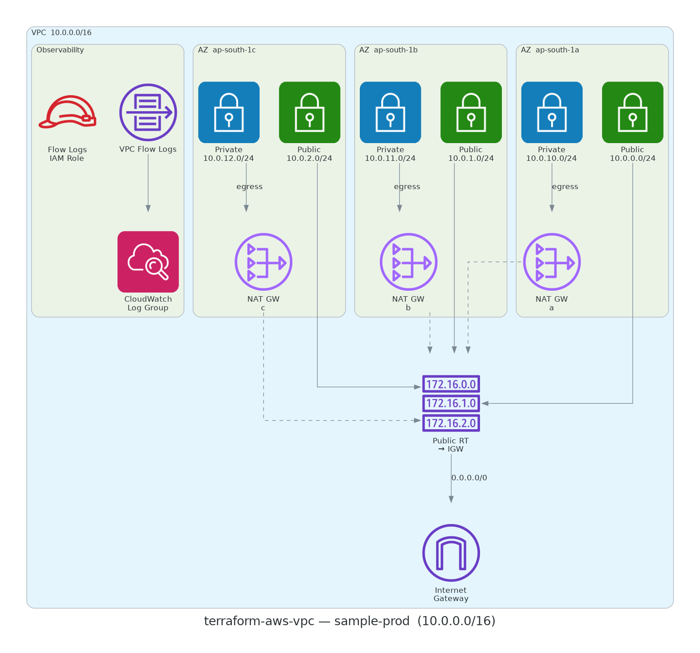

# terraform-aws-vpc

Production-grade AWS VPC module — public/private subnets, HA NAT gateways,
VPC Flow Logs, CIS-hardened default security group.

Part of the [Devotica Terraform module catalog](https://registry.terraform.io/modules/devotica-labs).

[](https://github.com/devotica-labs/terraform-aws-vpc/actions/workflows/ci.yml)
[](https://github.com/devotica-labs/terraform-aws-vpc/actions/workflows/architecture-diagram.yml)
[](LICENSE)

## Architecture

<!-- BEGIN_ARCH -->



<sub>Generated by `.github/workflows/architecture-diagram.yml` on every push to main. Do not edit the image by hand — change the Terraform code in `examples/complete/` and the bot will regenerate it.</sub>

<!-- END_ARCH -->

## Usage

### Basic

```hcl
module "vpc" {
  source = "../.."

  name               = "my-vpc"
  cidr_block         = "10.0.0.0/16"
  availability_zones = ["ap-south-1a", "ap-south-1b"]

  public_subnet_cidrs  = ["10.0.0.0/24", "10.0.1.0/24"]
  private_subnet_cidrs = ["10.0.10.0/24", "10.0.11.0/24"]
}
```

<!-- BEGIN_TF_DOCS -->


## Usage

### Basic

```hcl
# ---------------------------------------------------------------------------
# Provider block — CI-friendly skip flags + non-AWS-shaped placeholder creds.
#
# The skip_* flags let `terraform plan` run without calling STS
# GetCallerIdentity / EC2 IMDS. The access_key / secret_key values are
# intentionally NOT AWS-shaped (no AKIA / ASIA prefix, no 40-char base64)
# so gitleaks does not flag them as a leaked AWS access key — they exist
# only to satisfy the provider credential chain.
#
# In a real deployment, drop the skip_* flags AND the placeholder creds,
# and rely on your normal credential chain (OIDC role, profile,
# assume-role, etc.).
# ---------------------------------------------------------------------------
provider "aws" {
  region                      = "ap-south-1"
  access_key                  = "not-a-real-aws-key"
  secret_key                  = "not-a-real-aws-secret"
  skip_credentials_validation = true
  skip_metadata_api_check     = true
  skip_requesting_account_id  = true
}

# Uses local path during development.
# Change to Registry source after first release:
#   source  = "devotica-labs/vpc/aws"
#   version = "~> 1.0"

module "vpc" {
  source = "../.."

  name               = "my-vpc"
  cidr_block         = "10.0.0.0/16"
  availability_zones = ["ap-south-1a", "ap-south-1b"]

  public_subnet_cidrs  = ["10.0.0.0/24", "10.0.1.0/24"]
  private_subnet_cidrs = ["10.0.10.0/24", "10.0.11.0/24"]

  # Foundation Plan §15.2 — six mandatory tags on every resource.
  # In a real deployment, replace these values with your environment's.
  tags = {
    Environment = "example"
    Project     = "terraform-aws-vpc"
    Owner       = "platform@devotica.com"
    CostCenter  = "PLATFORM-OSS"
    ManagedBy   = "Terraform"
    Repo        = "https://github.com/devotica-labs/terraform-aws-vpc"
  }
}
```

### Complete

```hcl
# ---------------------------------------------------------------------------
# Provider block — CI-friendly skip flags + non-AWS-shaped placeholder creds.
#
# The skip_* flags let `terraform plan` run without calling STS
# GetCallerIdentity / EC2 IMDS. The access_key / secret_key values are
# intentionally NOT AWS-shaped (no AKIA / ASIA prefix, no 40-char base64)
# so gitleaks does not flag them as a leaked AWS access key — they exist
# only to satisfy the provider credential chain.
#
# In a real deployment, drop the skip_* flags AND the placeholder creds,
# and rely on your normal credential chain (OIDC role, profile,
# assume-role, etc.).
# ---------------------------------------------------------------------------
provider "aws" {
  region                      = "ap-south-1"
  access_key                  = "not-a-real-aws-key"
  secret_key                  = "not-a-real-aws-secret"
  skip_credentials_validation = true
  skip_metadata_api_check     = true
  skip_requesting_account_id  = true
}

# Uses local path during development.
# Change to Registry source after first release:
#   source  = "devotica-labs/vpc/aws"
#   version = "~> 1.0"

module "vpc" {
  source = "../.."

  name = "sample-prod"

  cidr_block           = "10.0.0.0/16"
  availability_zones   = ["ap-south-1a", "ap-south-1b", "ap-south-1c"]
  public_subnet_cidrs  = ["10.0.0.0/24", "10.0.1.0/24", "10.0.2.0/24"]
  private_subnet_cidrs = ["10.0.10.0/24", "10.0.11.0/24", "10.0.12.0/24"]

  enable_nat_gateway = true
  single_nat_gateway = false

  enable_dns_support   = true
  enable_dns_hostnames = true

  enable_ipv6 = true

  enable_flow_logs         = true
  flow_logs_retention_days = 90
  flow_logs_traffic_type   = "ALL"

  manage_default_security_group = true

  # Foundation Plan §15.2 — six mandatory tags on every resource.
  tags = {
    Environment = "production"
    Project     = "sample"
    Owner       = "cloud-team@example.com"
    CostCenter  = "platform"
    ManagedBy   = "Terraform"
    Repo        = "https://github.com/devotica-labs/terraform-aws-vpc"
  }
}
```

## Requirements

| Name | Version |
|------|---------|
| <a name="requirement_terraform"></a> [terraform](#requirement\_terraform) | >= 1.6.0, < 2.0.0 |
| <a name="requirement_aws"></a> [aws](#requirement\_aws) | ~> 6.44 |
## Providers

| Name | Version |
|------|---------|
| <a name="provider_aws"></a> [aws](#provider\_aws) | 6.47.0 |
## Resources

| Name | Type |
|------|------|
| [aws_cloudwatch_log_group.flow_logs](https://registry.terraform.io/providers/hashicorp/aws/latest/docs/resources/cloudwatch_log_group) | resource |
| [aws_default_security_group.this](https://registry.terraform.io/providers/hashicorp/aws/latest/docs/resources/default_security_group) | resource |
| [aws_eip.nat](https://registry.terraform.io/providers/hashicorp/aws/latest/docs/resources/eip) | resource |
| [aws_flow_log.this](https://registry.terraform.io/providers/hashicorp/aws/latest/docs/resources/flow_log) | resource |
| [aws_iam_role.flow_logs](https://registry.terraform.io/providers/hashicorp/aws/latest/docs/resources/iam_role) | resource |
| [aws_iam_role_policy.flow_logs](https://registry.terraform.io/providers/hashicorp/aws/latest/docs/resources/iam_role_policy) | resource |
| [aws_internet_gateway.this](https://registry.terraform.io/providers/hashicorp/aws/latest/docs/resources/internet_gateway) | resource |
| [aws_nat_gateway.this](https://registry.terraform.io/providers/hashicorp/aws/latest/docs/resources/nat_gateway) | resource |
| [aws_route.private_additional](https://registry.terraform.io/providers/hashicorp/aws/latest/docs/resources/route) | resource |
| [aws_route.private_nat](https://registry.terraform.io/providers/hashicorp/aws/latest/docs/resources/route) | resource |
| [aws_route.public_additional](https://registry.terraform.io/providers/hashicorp/aws/latest/docs/resources/route) | resource |
| [aws_route.public_igw](https://registry.terraform.io/providers/hashicorp/aws/latest/docs/resources/route) | resource |
| [aws_route_table.private](https://registry.terraform.io/providers/hashicorp/aws/latest/docs/resources/route_table) | resource |
| [aws_route_table.public](https://registry.terraform.io/providers/hashicorp/aws/latest/docs/resources/route_table) | resource |
| [aws_route_table_association.private](https://registry.terraform.io/providers/hashicorp/aws/latest/docs/resources/route_table_association) | resource |
| [aws_route_table_association.public](https://registry.terraform.io/providers/hashicorp/aws/latest/docs/resources/route_table_association) | resource |
| [aws_subnet.private](https://registry.terraform.io/providers/hashicorp/aws/latest/docs/resources/subnet) | resource |
| [aws_subnet.public](https://registry.terraform.io/providers/hashicorp/aws/latest/docs/resources/subnet) | resource |
| [aws_vpc.this](https://registry.terraform.io/providers/hashicorp/aws/latest/docs/resources/vpc) | resource |
| [aws_vpc_endpoint.dynamodb](https://registry.terraform.io/providers/hashicorp/aws/latest/docs/resources/vpc_endpoint) | resource |
| [aws_vpc_endpoint.s3](https://registry.terraform.io/providers/hashicorp/aws/latest/docs/resources/vpc_endpoint) | resource |
## Inputs

| Name | Description | Type | Default | Required |
|------|-------------|------|---------|:--------:|
| <a name="input_availability_zones"></a> [availability\_zones](#input\_availability\_zones) | Ordered list of AZ names to span (e.g. ["ap-south-1a", "ap-south-1b"]). Must have 2–6 entries. | `list(string)` | n/a | yes |
| <a name="input_cidr_block"></a> [cidr\_block](#input\_cidr\_block) | Primary IPv4 CIDR block for the VPC (e.g. 10.0.0.0/16). | `string` | n/a | yes |
| <a name="input_name"></a> [name](#input\_name) | Logical name for the VPC. Used as a prefix for all child resources. | `string` | n/a | yes |
| <a name="input_additional_private_routes"></a> [additional\_private\_routes](#input\_additional\_private\_routes) | Custom routes added to EVERY private route table (one per AZ). Each entry: one destination + one target. Same field shape as additional\_public\_routes. | <pre>list(object({<br/>    destination_cidr_block      = optional(string)<br/>    destination_ipv6_cidr_block = optional(string)<br/>    transit_gateway_id          = optional(string)<br/>    vpc_peering_connection_id   = optional(string)<br/>    gateway_id                  = optional(string)<br/>    nat_gateway_id              = optional(string)<br/>    network_interface_id        = optional(string)<br/>    vpc_endpoint_id             = optional(string)<br/>  }))</pre> | `[]` | no |
| <a name="input_additional_public_routes"></a> [additional\_public\_routes](#input\_additional\_public\_routes) | Custom routes added to the shared public route table beyond 0.0.0.0/0 → IGW. Each entry: one destination + one target. | <pre>list(object({<br/>    destination_cidr_block      = optional(string)<br/>    destination_ipv6_cidr_block = optional(string)<br/>    transit_gateway_id          = optional(string)<br/>    vpc_peering_connection_id   = optional(string)<br/>    gateway_id                  = optional(string)<br/>    nat_gateway_id              = optional(string)<br/>    network_interface_id        = optional(string)<br/>    vpc_endpoint_id             = optional(string)<br/>  }))</pre> | `[]` | no |
| <a name="input_enable_dns_hostnames"></a> [enable\_dns\_hostnames](#input\_enable\_dns\_hostnames) | Assign public DNS hostnames to instances with public IPs. | `bool` | `true` | no |
| <a name="input_enable_dns_support"></a> [enable\_dns\_support](#input\_enable\_dns\_support) | Enable DNS resolution in the VPC. | `bool` | `true` | no |
| <a name="input_enable_dynamodb_gateway_endpoint"></a> [enable\_dynamodb\_gateway\_endpoint](#input\_enable\_dynamodb\_gateway\_endpoint) | Create a free DynamoDB gateway VPC endpoint attached to every private route table. Removes NAT charges for DynamoDB traffic from private subnets. | `bool` | `false` | no |
| <a name="input_enable_flow_logs"></a> [enable\_flow\_logs](#input\_enable\_flow\_logs) | Enable VPC Flow Logs to CloudWatch Logs. | `bool` | `true` | no |
| <a name="input_enable_ipv6"></a> [enable\_ipv6](#input\_enable\_ipv6) | Request an Amazon-provided /56 IPv6 CIDR and assign /64 CIDRs to every subnet. | `bool` | `false` | no |
| <a name="input_enable_nat_gateway"></a> [enable\_nat\_gateway](#input\_enable\_nat\_gateway) | Create NAT gateways to give private subnets outbound Internet access. | `bool` | `true` | no |
| <a name="input_enable_s3_gateway_endpoint"></a> [enable\_s3\_gateway\_endpoint](#input\_enable\_s3\_gateway\_endpoint) | Create a free S3 gateway VPC endpoint attached to every private route table. Removes NAT charges for S3 traffic from private subnets. | `bool` | `false` | no |
| <a name="input_flow_logs_custom_format"></a> [flow\_logs\_custom\_format](#input\_flow\_logs\_custom\_format) | Custom log format string for VPC Flow Logs. Empty (default) uses the AWS default v2 format. Set to enable v5+ fields (pkt-srcaddr, pkt-dstaddr, vpc-id, az-id, sublocation-type, tcp-flags, traffic-path, etc.) — needed for fintech-grade audit, RBI/PCI traffic forensics, and ECMP/multi-path debugging. See https://docs.aws.amazon.com/vpc/latest/userguide/flow-logs.html#flow-log-records for the supported field list. | `string` | `""` | no |
| <a name="input_flow_logs_destination_type"></a> [flow\_logs\_destination\_type](#input\_flow\_logs\_destination\_type) | Where to ship VPC Flow Logs. 'cloud-watch-logs' (default) bills by ingestion + storage and integrates with CloudWatch Insights. 's3' is much cheaper for long retention (months/years) and is AWS's recommended destination for compliance / audit workloads. | `string` | `"cloud-watch-logs"` | no |
| <a name="input_flow_logs_retention_days"></a> [flow\_logs\_retention\_days](#input\_flow\_logs\_retention\_days) | CloudWatch Logs retention period for flow log entries. Ignored when flow\_logs\_destination\_type = 's3'. | `number` | `30` | no |
| <a name="input_flow_logs_s3_bucket_arn"></a> [flow\_logs\_s3\_bucket\_arn](#input\_flow\_logs\_s3\_bucket\_arn) | ARN of the S3 bucket (optionally with /prefix) to receive flow logs. Required when flow\_logs\_destination\_type = 's3'; ignored otherwise. The bucket must already exist and have an S3 bucket policy allowing the VPC Flow Logs service. | `string` | `""` | no |
| <a name="input_flow_logs_traffic_type"></a> [flow\_logs\_traffic\_type](#input\_flow\_logs\_traffic\_type) | Traffic to capture: ACCEPT, REJECT, or ALL. | `string` | `"ALL"` | no |
| <a name="input_manage_default_security_group"></a> [manage\_default\_security\_group](#input\_manage\_default\_security\_group) | Take ownership of the default security group and remove all rules (CIS AWS Foundations 4.3). | `bool` | `true` | no |
| <a name="input_private_subnet_cidrs"></a> [private\_subnet\_cidrs](#input\_private\_subnet\_cidrs) | IPv4 CIDRs for private subnets. Length must match availability\_zones. Leave empty to create no private subnets. | `list(string)` | `[]` | no |
| <a name="input_private_subnet_tags"></a> [private\_subnet\_tags](#input\_private\_subnet\_tags) | Tags applied ONLY to private subnets, in addition to var.tags. Common use: EKS internal-ELB discovery — set {"kubernetes.io/role/internal-elb" = "1"}. | `map(string)` | `{}` | no |
| <a name="input_public_subnet_cidrs"></a> [public\_subnet\_cidrs](#input\_public\_subnet\_cidrs) | IPv4 CIDRs for public subnets. Length must match availability\_zones. Leave empty to create no public subnets. | `list(string)` | `[]` | no |
| <a name="input_public_subnet_tags"></a> [public\_subnet\_tags](#input\_public\_subnet\_tags) | Tags applied ONLY to public subnets, in addition to var.tags. Common use: EKS ELB discovery — set {"kubernetes.io/role/elb" = "1"}. | `map(string)` | `{}` | no |
| <a name="input_single_nat_gateway"></a> [single\_nat\_gateway](#input\_single\_nat\_gateway) | Route all private subnets through one NAT gateway (first AZ). Reduces cost; not HA. Use only in dev/sandbox. | `bool` | `false` | no |
| <a name="input_tags"></a> [tags](#input\_tags) | Additional tags merged onto every taggable resource. | `map(string)` | `{}` | no |
## Outputs

| Name | Description |
|------|-------------|
| <a name="output_default_security_group_id"></a> [default\_security\_group\_id](#output\_default\_security\_group\_id) | ID of the default security group (locked down when manage\_default\_security\_group = true). |
| <a name="output_dynamodb_gateway_endpoint_id"></a> [dynamodb\_gateway\_endpoint\_id](#output\_dynamodb\_gateway\_endpoint\_id) | ID of the DynamoDB gateway VPC endpoint. Empty string when enable\_dynamodb\_gateway\_endpoint = false. |
| <a name="output_flow_log_cloudwatch_log_group_arn"></a> [flow\_log\_cloudwatch\_log\_group\_arn](#output\_flow\_log\_cloudwatch\_log\_group\_arn) | ARN of the CloudWatch Log Group for Flow Logs. Empty string when enable\_flow\_logs = false. |
| <a name="output_flow_log_id"></a> [flow\_log\_id](#output\_flow\_log\_id) | ID of the VPC Flow Log. Empty string when enable\_flow\_logs = false. |
| <a name="output_internet_gateway_id"></a> [internet\_gateway\_id](#output\_internet\_gateway\_id) | ID of the Internet Gateway. Empty string when no public subnets exist. |
| <a name="output_nat_gateway_ids"></a> [nat\_gateway\_ids](#output\_nat\_gateway\_ids) | List of NAT Gateway IDs. Empty list when enable\_nat\_gateway = false. |
| <a name="output_nat_public_ips"></a> [nat\_public\_ips](#output\_nat\_public\_ips) | Elastic IP addresses associated with NAT gateways. |
| <a name="output_private_route_table_ids"></a> [private\_route\_table\_ids](#output\_private\_route\_table\_ids) | List of private route table IDs in AZ order. |
| <a name="output_private_subnet_arns"></a> [private\_subnet\_arns](#output\_private\_subnet\_arns) | List of private subnet ARNs. |
| <a name="output_private_subnet_ids"></a> [private\_subnet\_ids](#output\_private\_subnet\_ids) | List of private subnet IDs in the same order as availability\_zones. |
| <a name="output_public_route_table_id"></a> [public\_route\_table\_id](#output\_public\_route\_table\_id) | ID of the shared public route table. Empty string when no public subnets exist. |
| <a name="output_public_subnet_arns"></a> [public\_subnet\_arns](#output\_public\_subnet\_arns) | List of public subnet ARNs. |
| <a name="output_public_subnet_ids"></a> [public\_subnet\_ids](#output\_public\_subnet\_ids) | List of public subnet IDs in the same order as availability\_zones. |
| <a name="output_s3_gateway_endpoint_id"></a> [s3\_gateway\_endpoint\_id](#output\_s3\_gateway\_endpoint\_id) | ID of the S3 gateway VPC endpoint. Empty string when enable\_s3\_gateway\_endpoint = false. |
| <a name="output_vpc_arn"></a> [vpc\_arn](#output\_vpc\_arn) | ARN of the VPC. |
| <a name="output_vpc_cidr_block"></a> [vpc\_cidr\_block](#output\_vpc\_cidr\_block) | Primary IPv4 CIDR block of the VPC. |
| <a name="output_vpc_id"></a> [vpc\_id](#output\_vpc\_id) | ID of the VPC. |
| <a name="output_vpc_ipv6_cidr_block"></a> [vpc\_ipv6\_cidr\_block](#output\_vpc\_ipv6\_cidr\_block) | Amazon-provided IPv6 CIDR. Empty string when enable\_ipv6 = false. |
<!-- END_TF_DOCS -->

## Acknowledgements

This module is derived from
[SourceFuse arc-network](https://github.com/sourcefuse/terraform-aws-arc-network)
(Apache-2.0). arc-network provided the architectural blueprint for the
public/private/NAT layout, the variable shape, and the flow-log + VPC
endpoint patterns. Devotica's fork adapts the module for fintech defaults
required by Indian financial-services regulations (RBI, DPDP, SEBI),
enforces stricter mandatory tags, and integrates with our central
governance stack:

- CI: [`devotica-labs/terraform-shared-config`](https://github.com/devotica-labs/terraform-shared-config)
- Policy: [`devotica-labs/terraform-policies`](https://github.com/devotica-labs/terraform-policies)
- Bootstrap: [`devotica-labs/terraform-bootstrap-template`](https://github.com/devotica-labs/terraform-bootstrap-template)

See [NOTICE](NOTICE) for the full attribution.

## License
Apache-2.0 — see [LICENSE](LICENSE).
